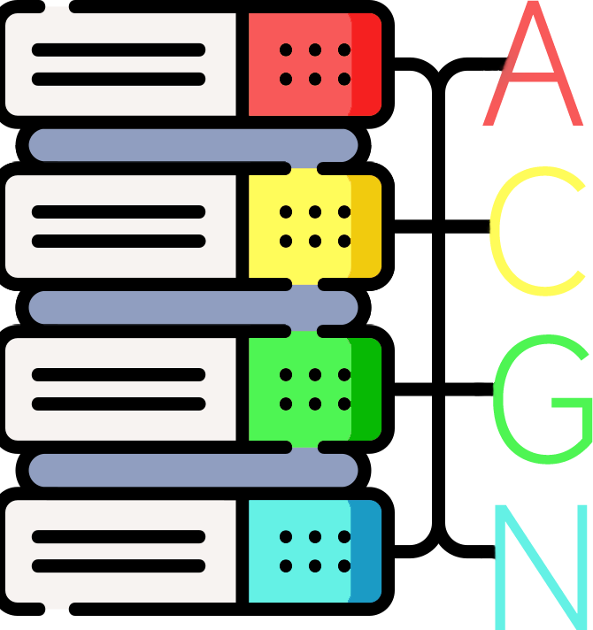

# Open ACGN Database (🔧Testing...)

💾An Open Database for ACGN+ (Animations, Comics, Games, Light Novels, etc...).

👷‍♂️Many features are still under development and test.

🛠️A Json2Markdown Generator is usable currently, with Github Action to make changes automatically.

📽️Only Animation Information is acceptable at this moment.

🚩To upload a new animation information, you only to fork this repository and upload a new JSON file for this animation, then you can make a pull request for your commit. Once the request is accepted, Github Action will generate the md file, so you don't need to create it manually.

#### Features in progress...

- 🎈Multiple Classes Support
- 🏛️Official Website (Laravel Based)
- 📤Open API
- 🌐CHN/JPN/ENG Support
